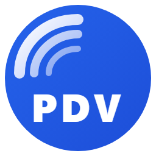
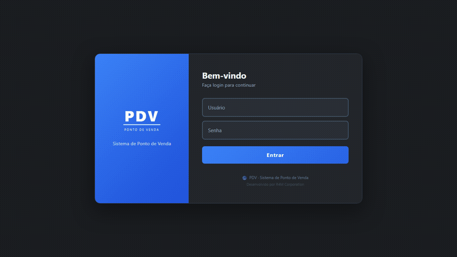
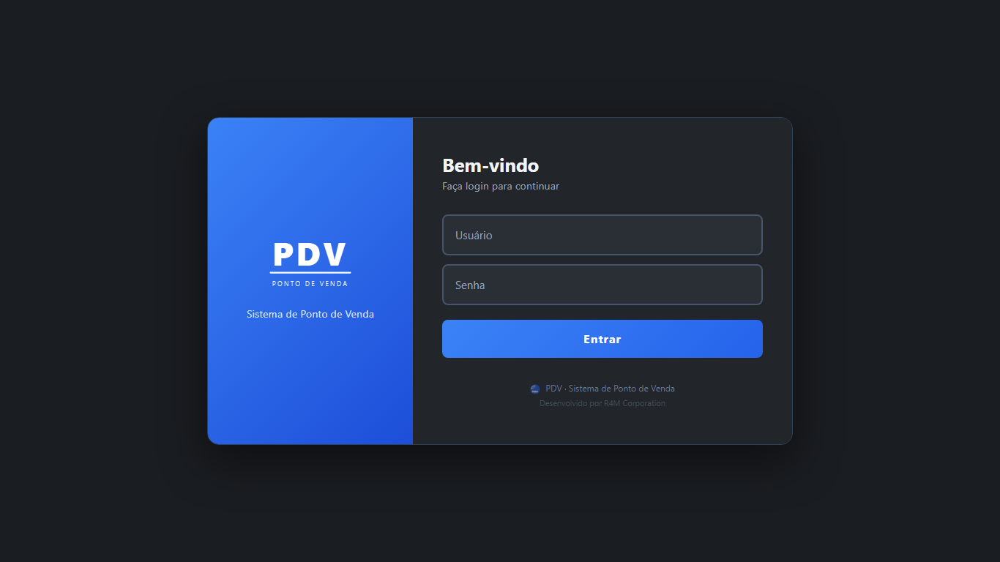
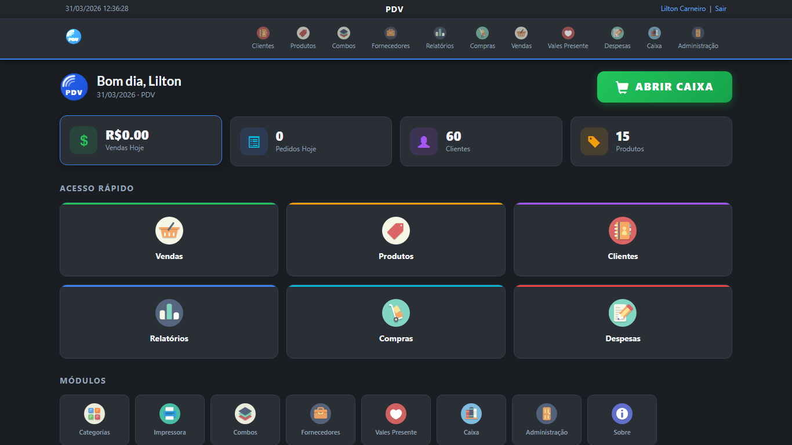
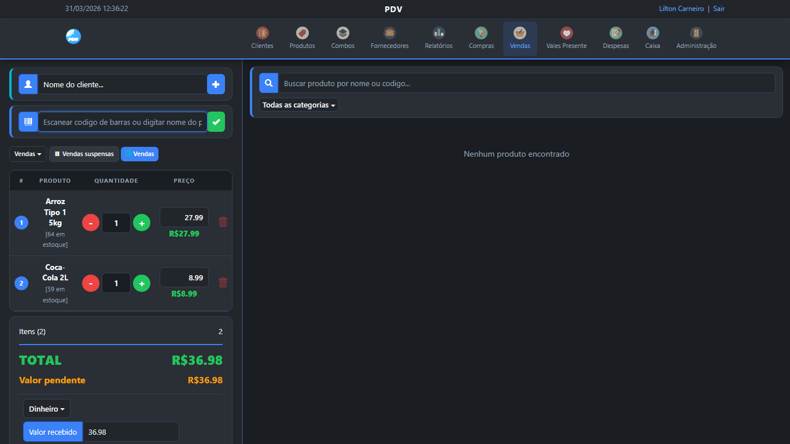
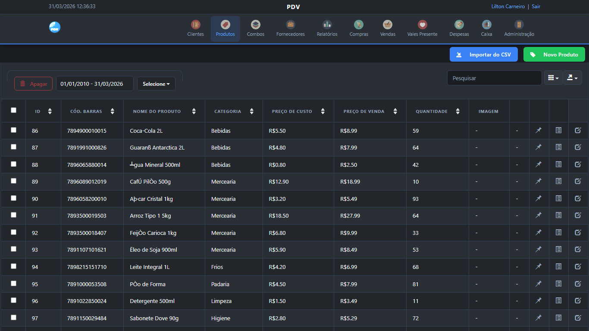
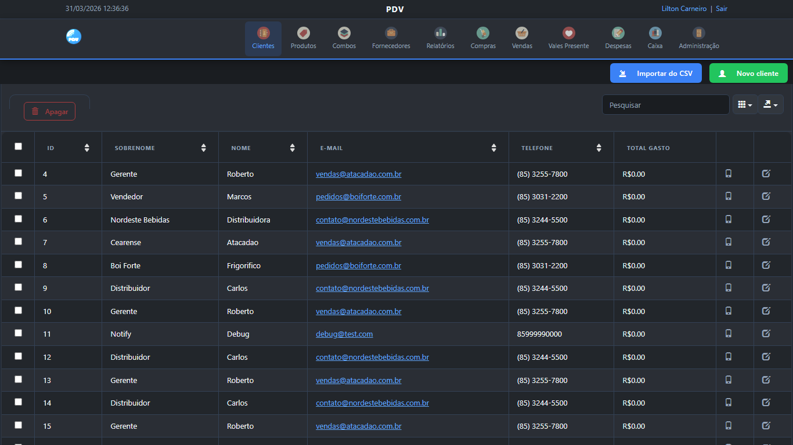
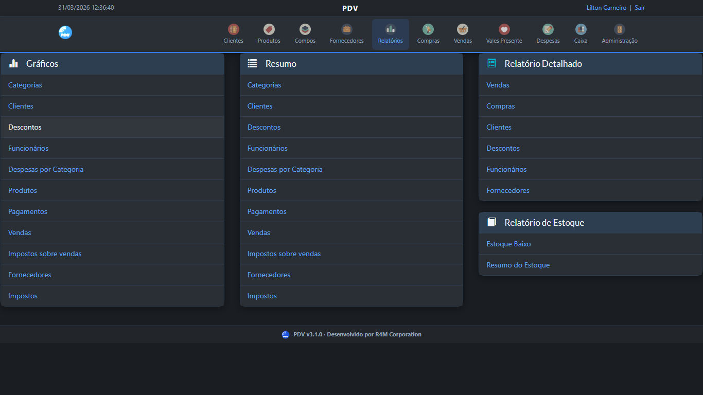
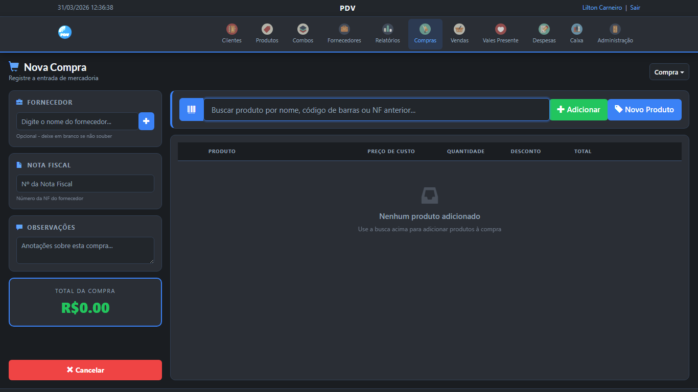
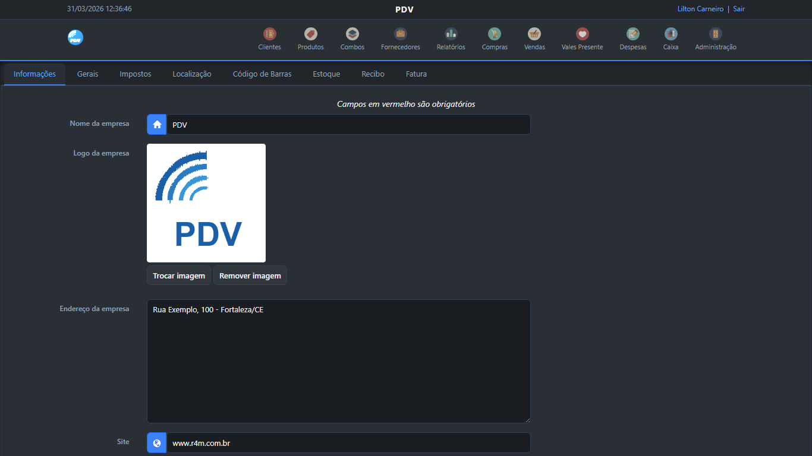

<div align="center">



# PDV

Solução de Ponto de Venda offline para comércios que precisam de simplicidade e confiabilidade.

Um único instalador com tudo incluso. Sem internet. Sem servidor externo.

[](#)
[](#)
[](#)

<br>



</div>

<br>

## Sobre

Meu tio tem um pequeno comércio em Fortaleza. Ele já tentou usar alguns sistemas de caixa, mas sempre esbarrava no mesmo problema: ou eram complexos demais pro dia a dia, ou não atendiam o que ele precisava, ou dependiam de internet, o que significava ficar sem sistema toda vez que a rede caía. Quando ele me pediu ajuda, vi uma oportunidade de colocar em prática o que eu sabia e aprender tecnologias novas no processo. Parti de um projeto open source e fui adaptando conforme a necessidade e a realidade do negócio dele.

Escolhi o [OpenSourcePOS](https://github.com/opensourcepos/opensourcepos) como ponto de partida, um PDV open source robusto, mas pensado para desenvolvedores e ambientes Linux. O desafio foi transformar isso num produto simples de instalar e usar no Windows, acessível pra qualquer pessoa.

O projeto foi crescendo conforme eu entendia melhor as necessidades de quem ia usar. A interface original era clara e genérica, então reescrevi tudo com dark mode. O sistema não tinha um painel inicial útil, então criei um dashboard com os números do dia. Não existia um fluxo de abertura de caixa integrado, então implementei um do zero.

O maior desafio técnico foi o empacotamento. Precisei colocar três servidores (Apache, MariaDB e PHP) dentro de um único instalador que funcionasse em qualquer Windows limpo. No meio do processo, descobri que a Microsoft descontinuou o VBScript no Windows 11, o que me obrigou a reconstruir todo o launcher em PowerShell puro, incluindo uma splash screen com WinForms.

A parte de localização também deu trabalho. O sistema original era todo em inglês, com formatos americanos. Precisei adaptar 24 arquivos de idioma, ajustar moeda, datas e separadores decimais pro padrão brasileiro, e repensar os nomes de alguns módulos pra ficarem compreensíveis pro meu tio e os funcionários dele. "Atributos", por exemplo, virou "Variações", que é como qualquer comerciante entende cor e tamanho de produto.

O resultado é um sistema que meu tio usa todo dia, instalado com dois cliques numa máquina que nunca teve nada antes.

## Funcionalidades

- **Vendas e Caixa**: O operador busca produtos pelo código de barras ou pelo nome, adiciona ao carrinho e finaliza a venda com a forma de pagamento que o cliente preferir: dinheiro, cartão, PIX ou fiado. Também é possível suspender uma venda e retomá-la depois. No início do turno, o operador abre o caixa informando o valor em dinheiro que está na gaveta. No final, o sistema compara automaticamente o que era esperado com o que foi contado, mostrando se houve sobra ou diferença.

- **Produtos**: Cada produto é cadastrado com foto, código de barras, preço de custo e preço de venda. É possível organizar por categorias, definir variações (como cor, tamanho ou peso) e agrupar produtos em combos. O controle de estoque funciona por localização, e o cadastro pode ser alimentado em massa através de importação de planilha CSV.

- **Clientes e Fornecedores**: O sistema mantém o cadastro de clientes com o histórico completo de compras. Para clientes que compram no fiado, há controle de crédito integrado. Fornecedores são cadastrados com vínculo direto às entradas de mercadoria, facilitando o rastreamento de quem forneceu o quê.

- **Financeiro**: Despesas da empresa são registradas por categoria, como aluguel, luz ou pagamento a fornecedores. Toda entrada de mercadoria fica documentada. Os relatórios cobrem vendas, estoque e financeiro por período, e podem ser exportados.

- **Combos**: Produtos podem ser agrupados em kits com preço especial. O administrador define quais itens compõem o combo e o valor final. Na venda, o operador adiciona o combo como um item único e o sistema desconta do estoque de cada produto individualmente.

- **Vales Presente**: O sistema permite criar vales com crédito pré-pago. O cliente compra um vale de determinado valor e utiliza como forma de pagamento em compras futuras. O saldo restante fica registrado e é abatido automaticamente nas próximas compras.

- **Impressão e Recibos**: Ao finalizar uma venda, o sistema gera um recibo com os dados da compra, com template pensado para impressoras térmicas no padrão brasileiro e corte automático do papel. O sistema detecta as impressoras instaladas no Windows e permite selecionar qual será usada. Também é possível enviar o recibo por email.

- **Ponto Eletrônico**: Funcionários registram entrada e saída diretamente no sistema. O administrador acompanha as horas trabalhadas por período e por funcionário.

- **Administração**: Cada funcionário tem seu próprio login com permissões configuráveis. O administrador define quais módulos cada pessoa pode acessar, garantindo que o operador de caixa veja apenas o que precisa para trabalhar. Pelo painel de configurações é possível personalizar os dados da empresa, gerenciar a equipe e ajustar o comportamento geral do sistema.

## Screenshots

<details>
<summary>Tela de Login</summary>
<br>

</details>

<details>
<summary>Dashboard</summary>
<br>

</details>

<details>
<summary>Tela de Vendas</summary>
<br>

</details>

<details>
<summary>Cadastro de Produtos</summary>
<br>

</details>

<details>
<summary>Cadastro de Clientes</summary>
<br>

</details>

<details>
<summary>Relatórios</summary>
<br>

</details>

<details>
<summary>Entrada de Mercadoria (Compras)</summary>
<br>

</details>

<details>
<summary>Configurações</summary>
<br>

</details>

## Arquitetura

```
Instalador_PDV.exe
├── Apache 2.4          Servidor web local
├── MariaDB 10.4        Banco de dados local
├── PHP 8.2             Backend
├── CodeIgniter 4       Framework
├── Bootstrap 4         Frontend
├── PowerShell          Launcher com splash screen
└── Inno Setup 6        Empacotamento e instalação
```

## Desafios técnicos e decisões de projeto

- **Escolha do banco de dados**: Avaliei algumas opções antes de definir o banco. O sistema precisava de algo que funcionasse bem em modo portátil, sem exigir configuração do usuário, e que aguentasse o uso do dia a dia de um comércio sem engasgar. MariaDB com InnoDB se encaixou: leve, estável, suporta acessos simultâneos e roda embalado dentro do instalador sem nenhum setup extra.

- **Empacotamento de três servidores num único instalador**: O instalador carrega Apache, MariaDB e PHP dentro. Na primeira execução, o launcher inicia os serviços em ordem, aguarda cada um responder, e só então abre o navegador. Se uma porta estiver ocupada ou um serviço falhar, o sistema identifica o problema, exibe um diagnóstico para o usuário e encerra os serviços que já foram iniciados para não deixar processos soltos.

- **Funcionar em qualquer Windows sem pré-requisitos**: O sistema precisava funcionar em qualquer máquina Windows sem depender de nada que já estivesse instalado. Todas as bibliotecas necessárias vão dentro do instalador, incluindo as DLLs do Visual C++ Runtime. O launcher foi construído em PowerShell, que é nativo do Windows, depois de identificar que o VBScript foi descontinuado pela Microsoft no Windows 11. A validação final foi feita no Windows Sandbox para garantir que nenhuma dependência externa ficou de fora.

- **Banco de dados portátil**: Mover um banco MariaDB com InnoDB entre máquinas não é trivial. Os arquivos de dados precisam estar sincronizados com o tablespace global, e qualquer inconsistência impede o banco de iniciar. O processo de build limpa referências órfãs e transaction logs antes de empacotar, garantindo que tudo funcione na primeira execução em qualquer máquina.

- **Tradução e formatação brasileira**: O sistema original tinha suporte a múltiplos idiomas, mas o português brasileiro era parcial e genérico. Reescrevi 24 arquivos de idioma, adaptei moeda para R$, datas para dd/mm/aaaa e separador decimal com vírgula. Módulos foram renomeados para termos que fazem sentido no comércio brasileiro, como "Combos" e "Compras". A tela de login, o cabeçalho, o rodapé e o dashboard foram personalizados com a identidade visual do produto.

- **Splash screen sem dependências externas**: O launcher precisava mostrar uma tela de carregamento enquanto os serviços iniciam, mas sem instalar nenhum framework adicional. A solução foi construir a interface direto em PowerShell usando WinForms, que já vem no Windows. O resultado é uma splash screen com barra animada e mensagens de status, sem nenhuma dependência extra.

## Requisitos

| Requisito | Mínimo |
|-----------|--------|
| Sistema | Windows 10 ou 11 (64-bit) |
| Processador | Intel ou AMD 64-bit |
| Memória | 2 GB RAM |
| Disco | 500 MB |
| Internet | Não necessário |

## Autor

> **Lilton Carneiro**<br>
> Desenvolvedor Full Stack<br>
> Fortaleza, CE

[](https://www.linkedin.com/in/lilton-costa-867891175/)
[](mailto:liltoncarneiro@gmail.com)
[](https://github.com/LiltonCosta)
